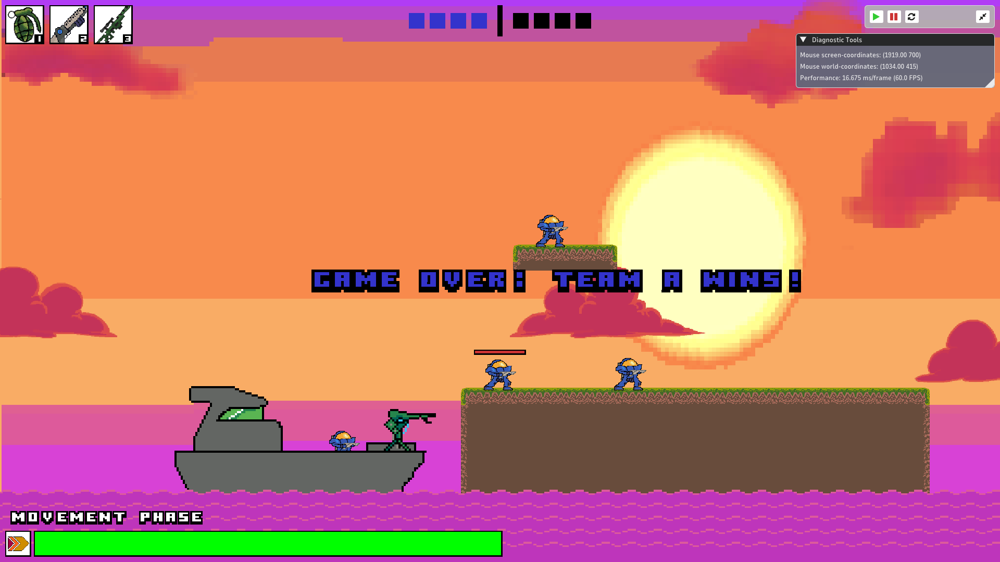

# Radiant Game Engine

Radiant is an all-in-one game engine library, equipped with its own rendering, physics, and sound engines. It contains a
variety of development tools that can be used to quickly create games and debug at runtime.

## Video Logs
[Game Engine Dev Log #1 DevTools](https://youtu.be/qKfr2LG_s3w?si=EI_yu2R-ZbsAusTS)

[Pacman Clone Made with Radiant Engine](https://youtu.be/WIDXBlXimdw?si=70vf1pxM3nlvduL-)

## Motivation

I decided to undergo this project for the joy of it, and game development is a hobby of mine. I have always been fascinated by the complex programs that are video games, and I wanted to get a deeper sense of how their inner-workings function. In this project I had to implement a wide-array of complicated systems; graphics, physics, and audio, all in their own right respectable challenges with a lot of theory behind them. Together they create a robust system that can create virtual worlds and interactive gameplay.

